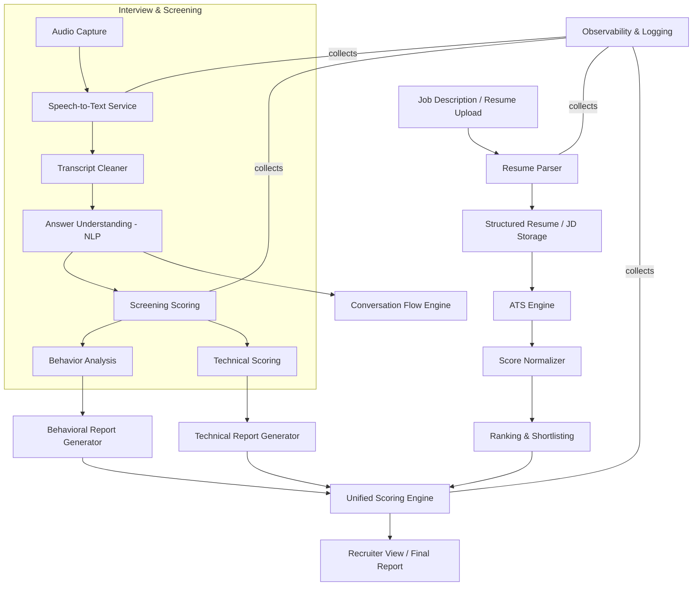
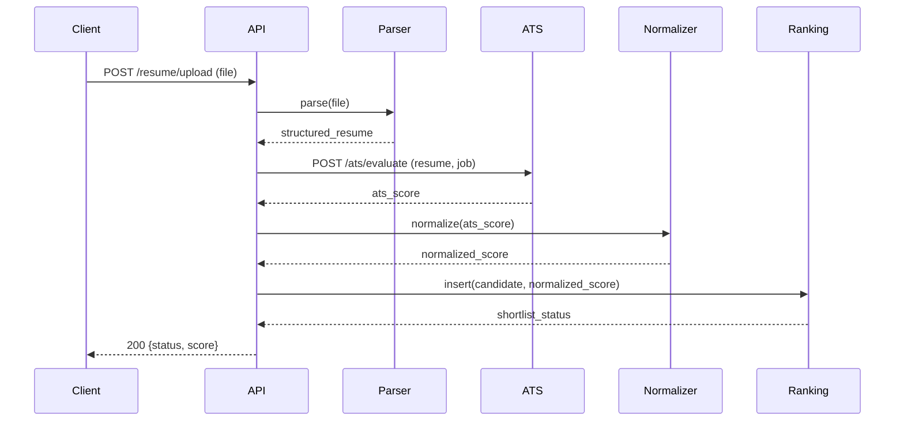
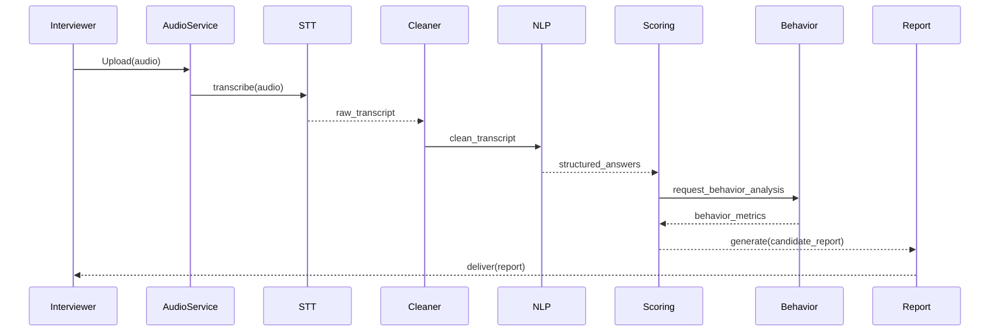

# System Diagrams

The diagrams below illustrate the main components and common request/processing sequences. Use these as a basis for PNG export or further refinement.

**Component Diagram (Mermaid flowchart)**

**Sequence Diagram: Resume -> ATS -> Shortlist**

**Sequence Diagram: Screening Call -> Scoring & Report**

Notes
- Export: render the Mermaid blocks in your preferred editor or Mermeid CLI to PNG/SVG.
- Files referenced in the diagrams map to code in the repository: `main.py`, `technical_scoring/`, `hr_scoring/`, `scoring/unified_scoring_engine.py`, `adaptive_followup/`.
